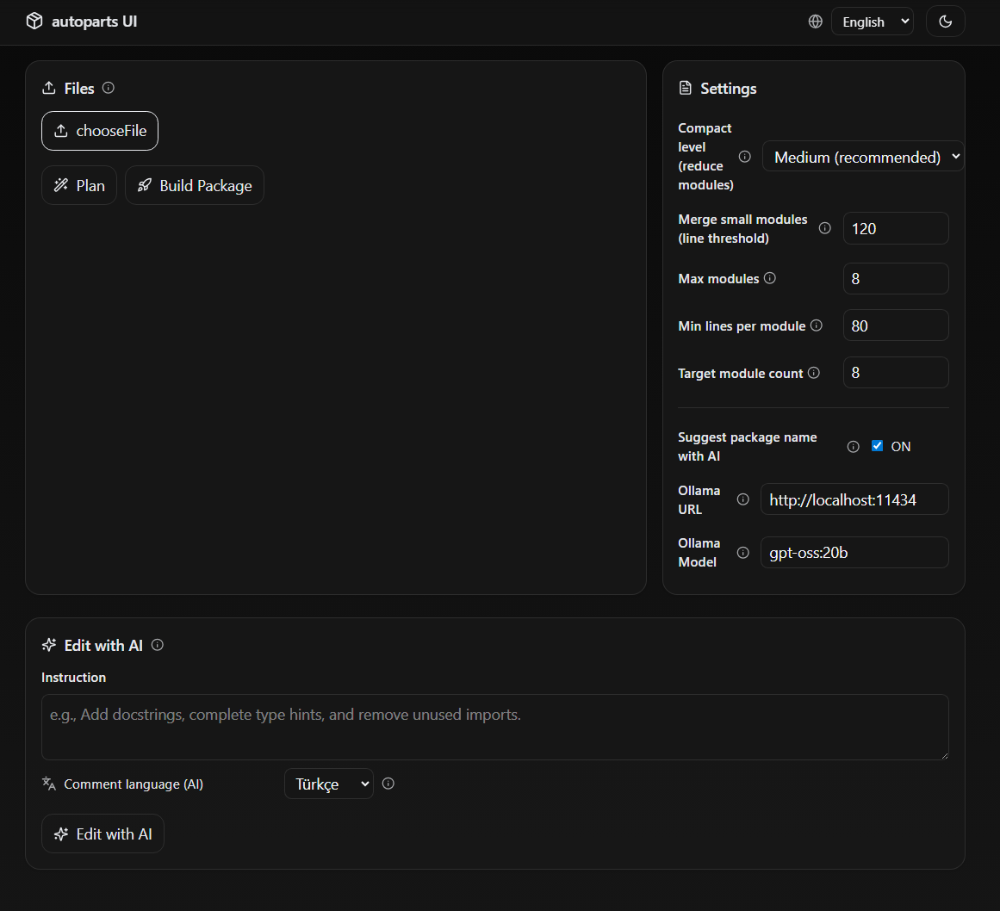
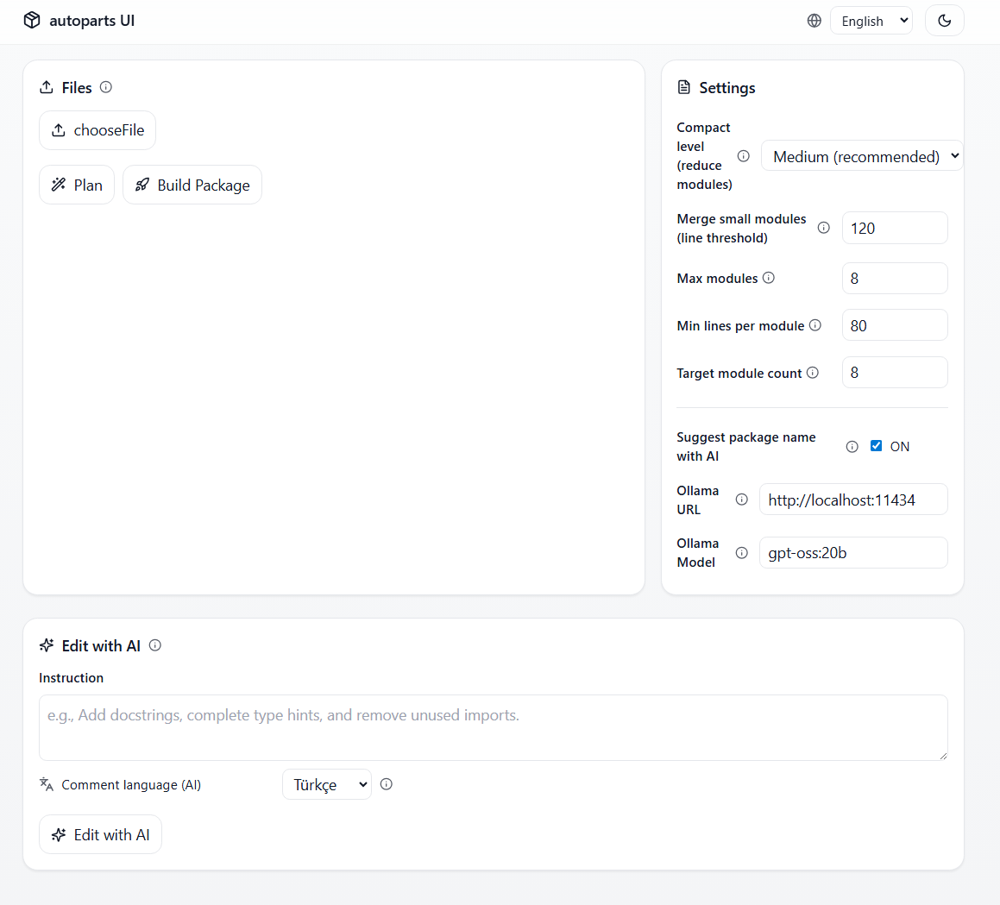

# Autoparts — AI‑assisted tool to turn Python files into a structured package

This repository contains a **FastAPI backend** (`server.py` + `autoparts.py`) and a **Vite + React + Tailwind** **web UI** (`ui/`). The goal is to take one or more `.py` files and transform them into a **modular Python package**, generate `__main__.py`, and produce a downloadable **`.zip`**. Optionally, it can use **Ollama** or **OpenAI** to suggest a package name and attempt small, safe edits.

## Features
- **Planning**: Analyze input file(s) and propose a module plan (`POST /plan`, `POST /plan_multi`).
- **Packaging**: Reorganize code into a **Python package** and return a **ZIP** (`POST /build`, `POST /build_multi`).
- **AI name suggestion**: Suggest a package name via **Ollama** or **OpenAI** (optional).
- **Compaction controls**: Merge tiny modules, set target module count, line thresholds, etc.
- **Web UI**: Upload files, preview the plan, build, and download the ZIP — all in the browser.

---

## Languages & Tech Stack

- **Input language**: **Python** (`.py`). The packager currently accepts **Python** sources only and outputs a structured **Python package** (with `__init__.py` and `__main__.py`).  
- **Backend**: **Python 3.10+**, **FastAPI**, **Uvicorn**, `python-multipart`; optional **Black** for formatting.  
- **Frontend**: **TypeScript** + **React** + **Vite** + **Tailwind CSS**.  
- **HTTP/CLI**: Examples use **cURL**, but any HTTP client works.  
- **AI providers (optional)**: **Ollama** (local) and **OpenAI** (cloud) for name suggestions and small, safe edits.

---




## Quick Start

### 1) Requirements
- **Python** ≥ 3.10
- **Node.js** ≥ 18 (compatible with Vite 5)
- (Optional) **Ollama** local server **or** an **OpenAI API key**

### 2) Clone & create a virtualenv
```bash
git clone <REPO_URL>.git
cd <REPO_NAME>

python -m venv .venv
# Windows
.\.venv\Scripts\activate
# macOS / Linux
source .venv/bin/activate

pip install -r requirements.txt
```

### 3) Environment variables
Create a `.env` file (you can copy from `.env.example`):
```
# .env
# If you want to use Ollama locally:
OLLAMA_BASE_URL=http://localhost:11434
OLLAMA_MODEL=llama3.1

# If you want to use OpenAI:
OPENAI_API_KEY=sk-...
```
> Both Ollama and OpenAI are optional. If AI naming fails or is disabled, a local naming fallback is used.

### 4) Run the backend
```bash
uvicorn server:app --reload --port 8000
```
- Health check: `GET http://localhost:8000/health`
- Root: `GET http://localhost:8000/` (lists available endpoints)

### 5) Run the frontend
```bash
cd ui
npm install
npm run dev
```
- The default API base is `http://localhost:8000` (see `API_BASE` in `ui/src/App.tsx`).  
- **Production**: `npm run build` creates `ui/dist` that you can serve behind any static server or reverse proxy (nginx, etc.).

---

## API Usage

### `POST /plan`
Analyze a single Python file and return a proposed module structure.
- **Form field**: `file` (single `.py`)

**cURL**
```bash
curl -X POST http://localhost:8000/plan   -F "file=@example.py"
```

### `POST /plan_multi`
Create a plan for multiple files.
- **Form fields**: `files` (multiple `.py`)

```bash
curl -X POST http://localhost:8000/plan_multi   -F "files=@a.py" -F "files=@b.py"
```

### `POST /build`
Package a single file and return a **ZIP**.
- **Form fields**:
  - `file`: `.py` file (required)
  - `package_name`: custom name (optional; provide it to **disable** AI name suggestion, or set `ai_name=false`)
  - `compact`: 0..3 compaction level (default `0`)
  - `pack_small_lines`, `max_modules`, `min_module_lines`, `target_modules`: advanced compaction knobs
  - `ai_name`: `true/false` (default `true`)
  - `ollama_base_url`, `ollama_model`: (optional) for AI name suggestion via Ollama

**cURL**
```bash
curl -X POST http://localhost:8000/build   -F "file=@example.py"   -F "compact=2"   -o output.zip
```

### `POST /build_multi`
Package multiple files into one package (returns ZIP).
- **Form fields**: `files` (multiple), plus the same compaction/AI options

```bash
curl -X POST http://localhost:8000/build_multi   -F "files=@a.py" -F "files=@b.py"   -F "compact=1"   -o output.zip
```

### `POST /ai_edit` and `POST /ai_edit_multi`
Attempt limited, safe edits to the source using AI (Ollama/OpenAI) when requested.

---

## Project Structure
```
autoparts.py       # Packaging/analysis logic (incl. AI name suggestion)
server.py          # FastAPI app and endpoints
ui/                # React + Vite + Tailwind web UI
  package.json
  src/
  ...
```

---


## Contributing

Contributions are welcome! See [CONTRIBUTING.md](CONTRIBUTING.md) for guidelines.
A list of people who have contributed is available in [CONTRIBUTORS.md](CONTRIBUTORS.md).
